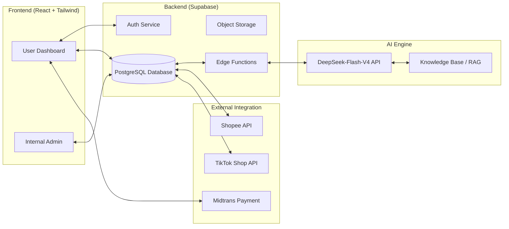

```mermaid
graph LR
    subgraph "Frontend (React + Tailwind)"
        UI[User Dashboard]
        ADM[Internal Admin]
    end

    subgraph "Backend (Supabase)"
        Auth[Auth Service]
        DB[(PostgreSQL Database)]
        Storage[Object Storage]
        Edge[Edge Functions]
    end

    subgraph "AI Engine"
        DS[DeepSeek-Flash-V4 API]
        RAG[Knowledge Base / RAG]
    end

    subgraph "External Integration"
        Shop[Shopee API]
        TT[TikTok Shop API]
        Pay[Midtrans Payment]
    end

    %% Connections
    UI <--> Auth
    UI <--> DB
    ADM <--> DB
    Edge <--> DS
    DS <--> RAG
    DB <--> Edge
    UI <--> Pay
    DB <--> Shop
    DB <--> TT
```
