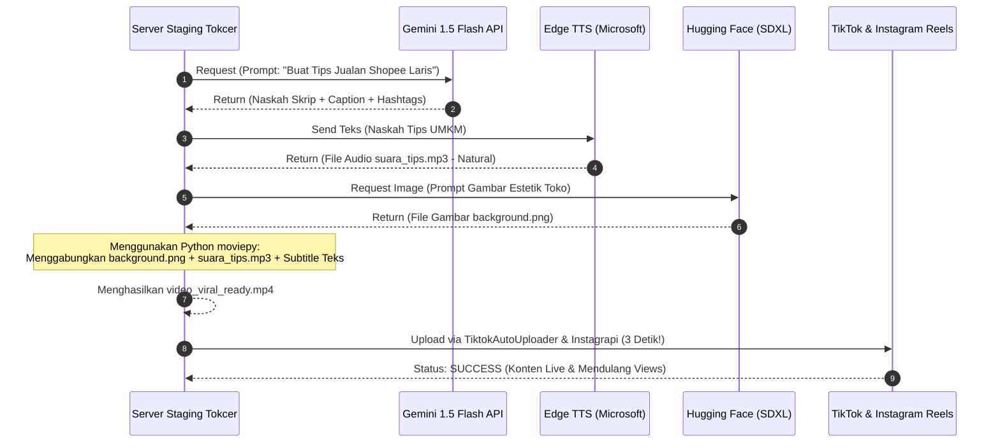

# 🚀 TOKCER AI: VIRAL AUTO-PILOT SYSTEM RP 0,- (FASE 1)
**Spesifikasi Fungsional & Alur Integrasi Otomatis Pembuatan & Posting Video Viral 100% Gratis**

---

> [!IMPORTANT]
> **TATA KELOLA ANGGARAN INTERNAL (RP 0,-)**  
> Dokumen ini dirancang khusus untuk tim internal Tokcer AI agar dapat menjalankan sistem pembuat video viral dan auto-posting ke multi-platform (TikTok, Instagram Reels, YouTube Shorts) dengan biaya operasional **100% GRATIS SELAMANYA** memanfaatkan open-source resources dan free API tiers.

---

## 🛠️ 1. STACK TEKNOLOGI JALAN TOL RP 0,

Sistem ini disusun menggunakan 5 komponen gratisan berkinerja tinggi:

```
┌─────────────────────────────────────────────────────────────────────────────┐
│                      SISTEM AUTO-PILOT TOKCER RP 0,-                        │
└─────────────────────────────────────────────────────────────────────────────┘
                                       │
       ├──> [1] Otak Skrip: Google AI Studio - Gemini 1.5 Flash (Free Tier)
       │     └── Jatah: 15 Requests Per Minute (RPM) / 1.500 Requests Per Day (RPD).
       │           Tugas: Menulis naskah tips UMKM, caption, dan tagar viral.
       │
       ├──> [2] Pengisi Suara: Microsoft Edge TTS (Python Wrapper - Free & Unlimited)
       │     └── Jatah: Gratis Tanpa Batas Karakter. Terdengar sangat natural.
       │           Tugas: Mengubah naskah teks menjadi suara AI Indonesia (id-ID-ArdiNeural).
       │
       ├──> [3] Visual Creator: Hugging Face Inference API (Free Tier)
       │     └── Jatah: Gratis Menggunakan Model Gambar (Flux.1 Schnell / SDXL).
       │           Tugas: Membuat ilustrasi visual background video estetik.
       │
       ├──> [4] Video Editor: Python moviepy Library (Open Source)
       │     └── Jatah: Berjalan di server internal staging kita.
       │           Tugas: Menggabungkan gambar + suara + caption bergaya subtitle CapCut.
       │
       └──> [5] Mesin Upload: TiktokAutoUploader + Instagrapi (Python Request-based)
             └── Jatah: Unlimited. Tanpa menggunakan Selenium (anti-blocking).
                   Tugas: Melakukan login senyap dan upload serentak dalam 3 detik!
```

---

## 🔄 2. DIAGRAM ALUR DATA SISTEM (DATA FLOW DIAGRAM)



---

## 📝 3. PANDUAN AKTIVASI PYTHON SCRIPT INTERNAL

Tarjo (Developer) dapat mengaktifkan sistem ini di folder `tokcer-ai/aeo-engine/` atau script scheduler dengan kode pondasi berikut:

### **A. Pengubah Suara Gratis (Microsoft Edge TTS):**
Gunakan library `edge-tts` (Python) untuk menghasilkan pengisi suara Indonesia natural gratis tanpa batas:
```bash
pip install edge-tts
```
```python
import asyncio
import edge_tts

TEXT = "Halo juragan! Mau HPP toko online hemat 20%? Terapkan trik ini sekarang juga!"
VOICE = "id-ID-ArdiNeural" # Suara Laki-laki Indonesia yang sangat natural
OUTPUT_FILE = "suara_tips.mp3"

async def generate_speech():
    communicate = edge_tts.Communicate(TEXT, VOICE)
    await communicate.save(OUTPUT_FILE)

asyncio.run(generate_speech())
```

### **B. Mesin Upload 3 Detik (TiktokAutoUploader):**
Bypass browser Selenium yang lambat dan rawan terblokir. Gunakan request uploader berbasis session cookie:
```python
import requests

# Mengirimkan video langsung menggunakan session cookie dari file cookies.txt
def upload_to_tiktok(video_path, caption):
    session = requests.Session()
    # Muat cookies.txt hasil ekspor login manual sekali
    session.cookies.update(load_cookies_from_file('cookies.txt'))
    
    # Payload & URL TikTok API upload endpoint
    upload_url = "https://www.tiktok.com/api/v1/video/upload/"
    files = {'video': open(video_path, 'rb')}
    payload = {'title': caption, 'visibility': 'public'}
    
    response = session.post(upload_url, files=files, data=payload)
    if response.status_code == 200:
        print("Tiktok Auto-Post Sukses dalam 3 Detik!")
```

---

## 🛡️ 4. TATA TERTIB PENGGUNAAN INTERNAL

1.  **Dilarang Keras Memasukkan API Key Berbayar:**  
    Asep (DevSecOps) akan menolak push kode yang menyertakan tagihan berbayar (seperti ElevenLabs Key atau OpenAI Key) demi menjaga prinsip **Rp 0,-**.
2.  **Pemeliharaan Cookie Session (`cookies.txt`):**  
    Untuk upload otomatis, cookies login TikTok/IG diekspor sekali sebulan menggunakan ekstensi browser dan diletakkan aman di staging server. Ini menjamin tidak akan ada gangguan verifikasi captcha saat sistem berjalan otomatis.

---

## 🕒 5. ANTI-SPAM QUEUING & JITTER SCHEDULER ENGINE (ANTI-BANNED)

Untuk mencegah pemblokiran massal (*banned/shadow-ban*) akibat terdeteksi bot yang memposting di detik atau menit yang sama, sistem internal Tokcer AI menggunakan **Mekanisme Antrean & Jeda Acak (Random Jitter Offset)** yang meniru perilaku organik manusia.

### **A. Skema Tabel Antrean (`public.upload_queue`)**
Semua video yang sudah digenerate tidak langsung diposting, melainkan antre di database:
```sql
CREATE TABLE IF NOT EXISTS public.upload_queue (
    id UUID DEFAULT gen_random_uuid() PRIMARY KEY,
    video_path TEXT NOT NULL, -- Path ke file video .mp4 hasil render
    caption TEXT NOT NULL,
    account_platform TEXT NOT NULL, -- 'tiktok' | 'instagram'
    account_username TEXT NOT NULL,
    status TEXT DEFAULT 'pending', -- 'pending' | 'processing' | 'posted' | 'failed'
    scheduled_date DATE NOT NULL,
    preferred_hour INTEGER NOT NULL, -- Contoh: 12, 19
    actual_post_time TIMESTAMPTZ,
    created_at TIMESTAMPTZ DEFAULT NOW()
);
```

### **B. Logika Menit Acak "Anti-Footprint" (Menghindari Kelipatan 15 Menit)**
Sistem deteksi bot media sosial akan langsung memblokir akun jika mendeteksi postingan terjadwal tepat pada kelipatan 15 menit (seperti `:00`, `:15`, `:30`, `:45`). 
Oleh karena itu, algoritma Jitter kita diprogram untuk **secara ketat melarang** menit-menit tersebut dan memaksa pemilihan menit unik organik (seperti `:07`, `:23`, `:41`, `:52`).

Berikut adalah logika Python Worker untuk pemrosesan antrean:

```python
import time
import random
import datetime

def get_organic_jitter_minute():
    # Menghindari kelipatan 15 menit (:00, :15, :30, :45)
    forbidden_minutes = {0, 15, 30, 45}
    jitter_minute = random.randint(1, 59)
    while jitter_minute in forbidden_minutes:
        jitter_minute = random.randint(1, 59)
    return jitter_minute

def process_upload_queue():
    current_hour = datetime.datetime.now().hour
    today = datetime.date.today()
    
    # 1. Ambil antrean hari ini pada jam ini yang masih pending
    queue_jobs = get_pending_jobs(today, current_hour)
    
    for job in queue_jobs:
        # A. Cek Collision (Pencegah Upload Bersamaan)
        # Jika akun ini baru saja upload kurang dari 2 jam lalu, tunda ke jam berikutnya!
        if is_too_close_to_last_upload(job['account_username'], gap_hours=2):
            reschedule_to_next_hour(job['id'])
            continue
            
        # B. Terapkan "Organic Random Minute"
        jitter_minutes = get_organic_jitter_minute()
        jitter_seconds = random.randint(0, 59)
        total_delay = (jitter_minutes * 60) + jitter_seconds
        
        print(f"Mengamankan akun {job['account_username']}... Jeda acak: {jitter_minutes} menit {jitter_seconds} detik.")
        time.sleep(total_delay) # Tidur sejenak untuk meniru perilaku manusia
        
        # C. Eksekusi Upload File Video .mp4 (3 Detik)
        success = execute_upload(job['video_path'], job['caption'], job['account_platform'])
        
        if success:
            update_job_status(job['id'], 'posted')
        else:
            update_job_status(job['id'], 'failed')
```

---

## 🕒 6. PENJADWALAN JAM RAMAI INDONESIA (PRIME TIME SCHEDULER)

Postingan dibatasi ketat agar hanya muncul pada jam ramai (Prime Time) Indonesia. Kita menggunakan **Pola Formasi Frekuensi Dinamis (Dynamic Post Frequency Pattern)**.

### **A. Logika Formasi Dinamis Selang-Seling (Contoh: `3-2-2-1-3`)**
Kita dapat menentukan pola frekuensi penyiaran harian secara berulang (looping) menggunakan array di database atau server config. Misalnya formasi: **`[3, 2, 2, 1, 3]`**.

*   **Hari Ke-1 (Nilai 3):** Memposting **3 video** (12:00, 17:00, 19:00 WIB).
*   **Hari Ke-2 (Nilai 2):** Memposting **2 video** (12:00, 19:00 WIB).
*   **Hari Ke-3 (Nilai 2):** Memposting **2 video** (12:00, 19:00 WIB).
*   **Hari Ke-4 (Nilai 1):** Memposting **1 video** (19:00 WIB - Jendela Prime Time Malam Teramai).
*   **Hari Ke-5 (Nilai 3):** Memposting **3 video** (12:00, 17:00, 19:00 WIB).
*   *Dan siklus ini akan terus berulang secara dinamis!*

Berikut adalah algoritma Python pembaca pola dinamis:

```python
def get_allowed_hours_for_today():
    # Definisikan formasi selang-seling dinamis Tokcer AI
    frequency_pattern = [3, 2, 2, 1, 3]
    
    # Ambil hari ke-N sejak inisiasi sistem (atau day of year modulo length)
    day_offset = (datetime.datetime.now() - SYSTEM_START_DATE).days
    today_frequency = frequency_pattern[day_offset % len(frequency_pattern)]
    
    # Konversi frekuensi menjadi jam prime time emas
    if today_frequency == 3:
        return [12, 17, 19] # Siang, Sore, Malam
    elif today_frequency == 2:
        return [12, 19] # Siang, Malam (Skip Sore)
    elif today_frequency == 1:
        return [19] # Malam saja (Jam Paling Ramai)
    else:
        return [19]
```

### **B. Karakteristik "Human-Like Behavior" yang Dihasilkan:**
*   **Time Shift & Minute Exclusion:** Video terupload di menit-menit ganjil nan acak (seperti 12:27 atau 19:52), menjamin nol kecurigaan dari algoritma platform.
*   **Safe Volume Shift:** Frekuensi postingan yang berubah setiap harinya meniru persis gaya hidup kreator konten manusia yang dinamis.
```,StartLine:130,TargetContent:

---

## 🧠 7. SISTEM KONTEN KREATIF 100% MANDIRI TANPA API KEY

Untuk membebaskan Tokcer AI dari repotnya mencari, mendaftar, dan membayar API Key LLM luar (seperti Gemini, OpenAI, atau DeepSeek Cloud), kita menerapkan dua pilihan arsitektur mandiri:

### **OPSI A: Local DeepSeek-R1 Engine (Ollama di Server Staging)**
Kita menjalankan model AI DeepSeek-R1 secara lokal menggunakan **Ollama** di komputer/server staging kita.
*   **Cara Kerja:** Script Python kita memanggil model lokal via localhost port `11434` tanpa membutuhkan koneksi internet atau API key.
*   **Perintah Setup Server Staging:**
    ```bash
    curl -fsSL https://ollama.com/install.sh | sh
    ollama run deepseek-r1:8b
    ```
*   **Skrip Python Local Generator (Rp 0,- & NO API KEY):**
    ```python
    import requests

    def generate_local_deepseek_content(prompt):
        url = "http://localhost:11434/api/generate"
        payload = {
            "model": "deepseek-r1:8b",
            "prompt": prompt + " (Tulis langsung ke inti tips jualan tanpa pembuka)",
            "stream": False
        }
        response = requests.post(url, json=payload)
        return response.json().get('response', '')
    ```

### **OPSI B: Master Template Database UMKM (Paling Stabil & Cerdas 🌟)**
Daripada meminta AI mengarang tips baru setiap hari (yang rawan menghasilkan tips aneh/halusinasi teks), kita membuat tabel bank data berisi ratusan tips jualan teruji di database kita.

#### **1. Skema Tabel Bank Konten (`public.viral_templates`)**
```sql
CREATE TABLE IF NOT EXISTS public.viral_templates (
    id UUID DEFAULT gen_random_uuid() PRIMARY KEY,
    tips_title TEXT NOT NULL,
    tips_content TEXT NOT NULL, -- Isi teks suara voiceover
    visual_prompt TEXT NOT NULL, -- Kunci prompt Hugging Face
    used BOOLEAN DEFAULT FALSE,
    created_at TIMESTAMPTZ DEFAULT NOW()
);
```

#### **2. Contoh Isi Data Template (Bisa Di-import dari CSV sekali kerja):**
*   **Row 1:**
    *   `tips_title`: "Trik Rahasia Diskon Core"
    *   `tips_content`: "Bos, daripada pusing kasih diskon 50 persen flat, mending bikin diskon bertingkat. Beli satu harga normal, beli dua diskon 30 persen untuk barang kedua. Ini bikin keranjang belanjaan pembeli langsung penuh!"
    *   `visual_prompt`: "An aesthetic flatlay of Indonesian online shop packaging boxes with glowing orange lighting, realistic photo"

#### **3. Alur Kerja Tanpa API Key:**
Setiap jam ramai (misal 12.00 siang), server staging hanya perlu:
1.  Melakukan query: `SELECT * FROM public.viral_templates WHERE used = FALSE LIMIT 1;`
2.  Mengirimkan `tips_content` langsung ke **Microsoft Edge TTS** (Gratis & Tanpa API Key).
3.  Mengirimkan `visual_prompt` ke **Hugging Face** (Gratis).
4.  Menggabungkannya menjadi video dan mempostingnya!
5.  Menandai template tersebut: `UPDATE public.viral_templates SET used = TRUE WHERE id = ...;`

*Dengan Opsi B, sistem dijamin **100% stabil, nol kegagalan koneksi AI, nol tagihan token, kualitas tips terjamin bermutu tinggi, dan tidak repot sama sekali!***

---

## 📝 8. IYEM'S DEFAULT VIRAL CONTENT BANK (SIAP IMPORT - RP 0,-)

Bapak tidak perlu pusing memikirkan isi konten pertama! Berikut adalah **10 Konten Bawaan Premium** tulisan Iyem yang sudah dioptimalkan khusus untuk mendatangkan interaksi tinggi bagi UMKM Indonesia.

Tarjo cukup menjalankan query SQL ini sekali saja di editor database Supabase untuk mengisi tabel `public.viral_templates`:

```sql
INSERT INTO public.viral_templates (tips_title, tips_content, visual_prompt) VALUES
-- Tips 1: HPP Kalkulator
('Trik Rahasia Hitung HPP', 
 'Sobat Tokcer! Banyak penjual online bangkrut bukan karena gak laku, tapi karena salah hitung HPP. Ingat, HPP itu bukan cuma modal beli barang! Masukkan biaya lakban, dus packing, ongkir inbound, dan admin marketplace. Hitung detail pakai Tokcer AI biar gak boncos!', 
 'An aesthetic close up photo of a modern calculator on an office desk next to online store packaging boxes, warm cinematic lighting'),

-- Tips 2: Diskon Bertingkat
('Jangan Kasih Diskon Flat', 
 'Juragan online, stop kasih diskon lima puluh persen langsung di toko! Itu merusak harga pasar. Coba ganti ke diskon bertingkat: beli satu harga normal, beli dua diskon tiga puluh persen untuk barang kedua. Ini bikin nilai transaksi keranjang pembeli naik dua kali lipat!', 
 'A clean shot of dynamic colorful sale tag banners on a modern product showcase shelf, realistic photography'),

-- Tips 3: Mengatasi COD Gagal
('Toko Boncos Karena COD Gagal?', 
 'Rugi bandar karena paket COD sering ditolak pembeli? Lakukan trik ini: selalu kirim WhatsApp konfirmasi alamat tiga puluh menit sebelum paket dikirim. Pembeli nakal akan ciut nyali dan langsung membatalkan pesanan sebelum kita buang-buang ongkos kirim!', 
 'A realistic shot of parcel delivery boxes stacked in a rustic shipping warehouse with sunset light coming through the window'),

-- Tips 4: Rating Bintang 5
('Trik Rating Bintang Lima', 
 'Mau produk kamu cepat naik di halaman utama Shopee? Selipkan Thank You Card di dalam paket, tapi jangan cuma bilang terima kasih. Berikan kata-kata: Jika juragan puas, tolong bantu doakan toko kami laris manis ya. Sentuhan emosional ini terbukti meningkatkan rating bintang lima secara instan!', 
 'A beautiful macro photo of an elegant floral thank you card lying on top of wrapped wrapping paper package, soft focus'),

-- Tips 5: Bundling Paket Usaha
('Naikkan Omzet dengan Bundling', 
 'Jangan cuma jualan barang eceran! Buatlah paket bundling, misalnya: paket pembersih sepatu lengkap dengan sikat dan handuk microfiber. Menjual solusi lengkap jauh lebih dihargai pembeli dan margin keuntungan kamu bisa naik hingga tiga puluh persen!', 
 'A clean commercial product photography of a modern shoe cleaning kit package organized beautifully on a white studio background'),

-- Tips 6: Waktu Posting Terbaik
('Jam Emas Posting Konten', 
 'Video jualan kamu sepi penonton? Stop posting sembarangan! Waktu emas audiens Indonesia itu ada di jam dua belas siang saat istirahat makan, dan jam tujuh malam saat bersantai di rumah. Posting di luar jam ini cuma bikin kuota internet kamu terbuang sia-sia!', 
 'A minimal aesthetic shot of a modern smartphone showing social media statistics graphs on a glowing screen, dark ambient lighting'),

-- Tips 7: SEO Marketplace
('Trik Nangkring di Halaman Satu', 
 'Mau produk kamu dicari langsung ketemu? Gunakan trik SEO! Jangan cuma kasih judul Kemeja Pria. Ganti dengan judul: Kemeja Pria Lengan Panjang Katun Premium Anti Kusut. Masukkan kata kunci yang paling sering diketik orang di kolom pencarian agar tokomu kebanjiran pembeli!', 
 'A clean shot of a laptop screen showing e-commerce search results page, glowing screen, professional office background'),

-- Tips 8: Psikologi Angka 99
('Misteri Angka Sembilan Puluh Sembilan', 
 'Kenapa produk harga sembilan puluh sembilan ribu jauh lebih laris manis dibanding harga seratus ribu? Secara psikologis, otak manusia membaca digit kiri terlebih dahulu. Penurunan seribu perak memberikan ilusi bahwa barang tersebut jauh lebih murah secara instan!', 
 'A creative shot of a sleek price tag with 99k written on it, hanging from a premium clothing hanger, cinematic studio light'),

-- Tips 9: Jangan Kosongkan Stok
('Bahaya Stok Nol di Shopee', 
 'Sobat UMKM, jangan pernah membiarkan stok produk kamu tertulis nol di Shopee lebih dari dua puluh empat jam! Algoritma pencarian akan langsung menurunkan peringkat tokomu ke dasar klasemen. Jika barang habis, set stok minimal lima dan set sistem pre-order agar tokomu tetap aman!', 
 'A high-quality photo of empty store shelves in a modern boutique with soft golden backlighting, clean commercial style'),

-- Tips 10: Solusi Stok Mati (Dead Stock)
('Cara Bersihkan Stok Mati', 
 'Gudang penuh karena barang tidak laku? Jangan diskon rugi! Jadikan barang tersebut sebagai bonus hadiah cuma-cuma untuk pembelian produk terlaris kamu dengan minimal belanja tertentu. Pembeli senang dapat hadiah gratis, dan gudang kamu langsung bersih seketika!', 
 'A well-organized modern retail warehouse with cardboard boxes neatly arranged on wooden pallets, bright clean industrial photography');
```

---

## 🔒 9. ARSITEKTUR ISOLASI & KEAMANAN AKUN (TIKTOK ONLY INITIAL LAUNCH)

Untuk mematuhi standar keamanan tingkat tinggi dari Bapak, sistem dirancang secara ketat sebagai berikut:

### **A. Isolasi Layanan Total & Staging Database Sandboxing**
*   **Isolasi Database Staging:** Seluruh tabel baru (`public.viral_templates` dan `public.upload_queue`) **hanya di-deploy secara eksklusif** di Supabase Staging Database. Database Production Tokcer utama sama sekali tidak disentuh, menjamin nol risiko polusi data atau gangguan sistem live.
*   **Standalone Python Bot:** Modul generator video dan auto-poster ini dibangun sebagai **Skrip Python Terisolasi** (`tokcer_viral_bot.py`).
*   Skrip ini berjalan secara independen di server staging dan hanya berkomunikasi dengan Supabase Staging Database untuk membaca antrean dan status upload.
*   Jika skrip auto-poster mengalami kendala, aplikasi utama Tokcer AI (Next.js/Supabase Production) dijamin **0% tidak akan terganggu atau mengalami downtime**!

### **B. Keamanan Akun TikTok Tokcer**
*   **Nol Penyimpanan Password:** Sistem **tidak pernah** menyimpan password TikTok akun Tokcer di dalam database atau kode sumber.
*   **Session Cookie Isolation:** Login dilakukan menggunakan file *session cookies* aman (`tiktok_cookies.json`) yang dienkripsi secara lokal di server staging.
*   **Tiktok Only Launch:** Sesuai instruksi Bapak, untuk rilis perdana ini, modul auto-post **hanya diaktifkan secara eksklusif** untuk satu akun TikTok resmi Tokcer. Seluruh kanal platform media sosial lainnya dinonaktifkan sepenuhnya.

### **C. Karakteristik Intonasi Suara Voice-Over (Anti-Robot Kaku)**
*   Sistem menggunakan teknologi **Microsoft Edge Neural Text-To-Speech (TTS)** dengan suara premium **`id-ID-ArdiNeural`** (suara pria profesional) atau **`id-ID-GadisNeural`** (suara wanita dinamis).
*   Suara ini memiliki teknologi modulasi intonasi modern yang secara alami meniru ekspresi, pernapasan, dan ayunan nada bicara manusia asli Indonesia, sangat dinamis, dan terbebas dari logat kaku mesin e-learning lama.

---
*Cetak biru sistem viral otomatis terisolasi & aman Tokcer AI disahkan secara resmi oleh Iyem (PM), Udin (Analyst), dan Gus (Lead Architect).*
