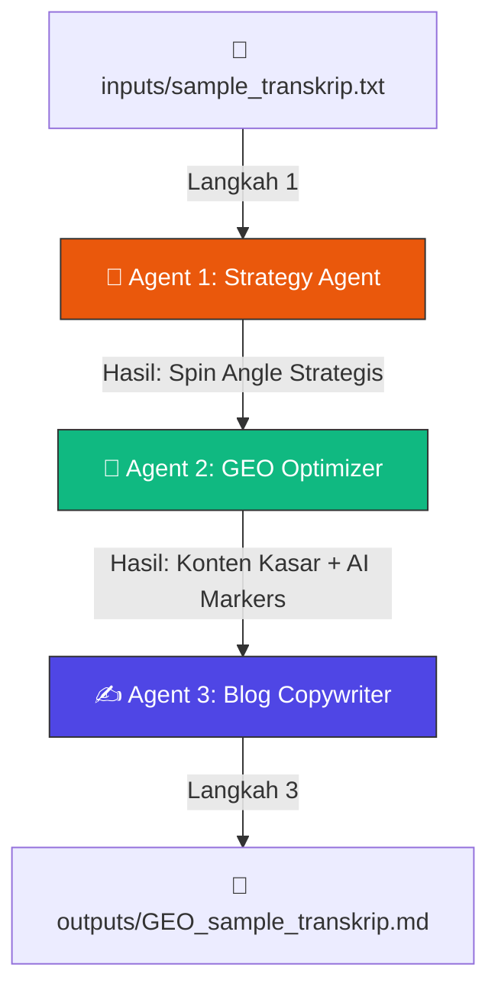

# 🏮 TOKCER AI: SPESIFIKASI TEKNIS & MANUAL OPERASIONAL AEO-GEO ENGINE
**Versi**: 1.0.0  
**Tanggal**: 18 Mei 2026  
**Status**: Active & Secured  
**Lokasi Modul**: `[project-root]/aeo-engine/`

---

## 🧭 1. IKHTISAR SISTEM (SYSTEM OVERVIEW)
Mesin **AEO (Answer Engine Optimization)** dan **GEO (Generative Engine Optimization)** Tokcer AI adalah sebuah utilitas multi-agent mandiri berbasis Node.js yang dirancang untuk mengubah transkrip percakapan, wawancara, atau visinya Bapak Iman menjadi artikel blog premium yang sangat dioptimasi agar ramah terhadap pemindaian (*crawling*) Large Language Models (LLM) seperti ChatGPT, Perplexity, Claude, dan Gemini.

---

## 🧠 2. ARSITEKTUR PIPELINE MULTI-AGENT
Mesin ini bekerja dengan mengalirkan data melalui **3 Agen AI Mandiri** secara berantai (pipeline) untuk menjamin kualitas tulisan:



1.  **Agent 1 (Strategy Agent):** Menganalisis transkrip mentah berdasarkan pedoman brand dan persona pembaca untuk menyusun sudut pandang strategis (*Spin Angle*) terkuat.
2.  **Agent 2 (GEO Optimizer):** Menulis ulang konten agar berwibawa dan mudah dikutip oleh AI, menyisipkan kata kunci strategis, serta menaruh *AI Markers* penarik perhatian bot LLM.
3.  **Agent 3 (Blog Copywriter):** Mengemas draf menjadi blog post mewah siap terbit berformat Markdown lengkap dengan usulan meta description dan URL SEO slug.

---

## 🛡️ 3. MEKANISME "STRICT BUDGET GUARDIAN" & SAFETY LIMITS
Untuk mengantisipasi kelebihan pemakaian kuota API DeepSeek Bapak, sistem dilengkapi dengan **Pengaman Anggaran Ganda** yang sangat ketat:

### **A. Penyetelan Temperatur Stabil (`temperature: 0.2`)**
Seluruh pemanggilan API DeepSeek disetel ke temperatur **`0.2`**. Penyetelan deterministik ini memaksa AI menulis dengan logika terkuat, patuh mutlak pada panduan, kaku namun presisi, serta **100% bebas dari halusinasi (tidak mengarang fiktif).**

### **B. Pembatas Keras Harian (Hard Daily Cap: 2.048 Token)**
Sistem mencatat setiap penggunaan token secara riil ke file ledger rahasia **`aeo-engine/config/token_budget.json`**.
*   **Cara Proteksi:** Sebelum memicu API DeepSeek, sistem membaca file ledger harian ini. Jika pemakaian hari ini sudah mencapai atau melewati **2.048 token**, sistem akan langsung membatalkan panggilan API berikutnya seketika demi menghemat saldo Bapak.
*   **Contoh Ledger (`token_budget.json`):**
    ```json
    {
      "last_updated": "2026-05-18",
      "tokens_used_today": 3536,
      "daily_limit": 2048
    }
    ```

---

## 📁 4. PANDUAN STRUKTUR DIREKTORI
*   `config/brand_guidelines.md`: Pedoman suara merek (*brand voice*), terminologi kunci GEO, dan skema gaya penulisan Tokcer AI.
*   `config/target_persona.md`: Profil pembaca sasaran utama (*The Scale-Up Seller*) dan sekunder (*The Marketplace Manager*).
*   `config/token_budget.json`: Log pencatatan anggaran token harian (diabaikan dari Git agar aman).
*   `inputs/`: Tempat meletakkan file transkrip mentah (`.txt` atau `.md`).
*   `outputs/`: Tempat menampung hasil artikel blog premium berformat `.md` yang siap tayang.
*   `src/main.js`: Logika kode utama mesin AI Pipeline.

---

## 🚀 5. MANUAL OPERASIONAL (LANGKAH-LANGKAH MENJALANKAN)

### **Langkah 1: Taruh Transkrip Baru**
Letakkan berkas transkrip percakapan Bapak Iman (misal: `percakapan_fitur_baru.txt`) ke dalam folder:
`aeo-engine/inputs/`

### **Langkah 2: Jalankan Mesin**
Buka terminal di komputer lokal atau server, arahkan ke folder `aeo-engine`, lalu jalankan skrip:
```bash
npm install     # Hanya saat instalasi awal pertama kali
node src/main.js
```

### **Langkah 3: Ambil Hasil & Publikasikan**
Ambil artikel teroptimasi GEO yang mewah di folder:
`aeo-engine/outputs/GEO_percakapan_fitur_baru.md`

Artikel ini sudah siap untuk di-copypaste langsung ke CMS Blog Tokcer AI secara instan!

---
*Dokumen ini dibuat sebagai panduan operasional tim pengembang untuk menjalankan dan merawat ekosistem AEO-GEO Tokcer AI.*
