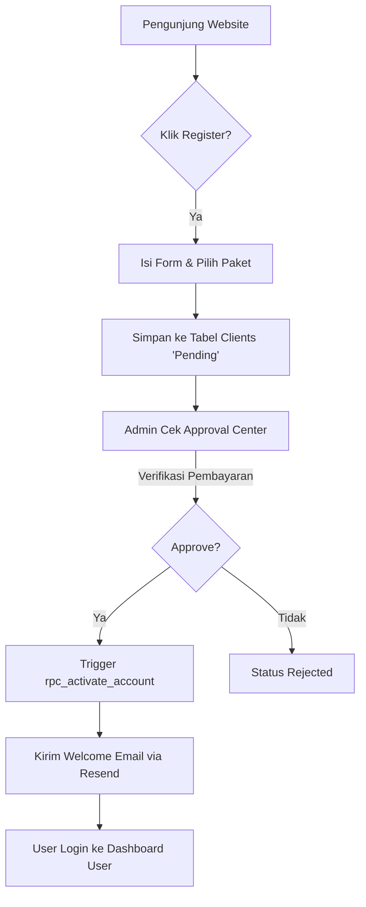
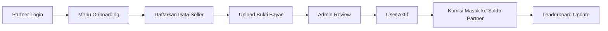
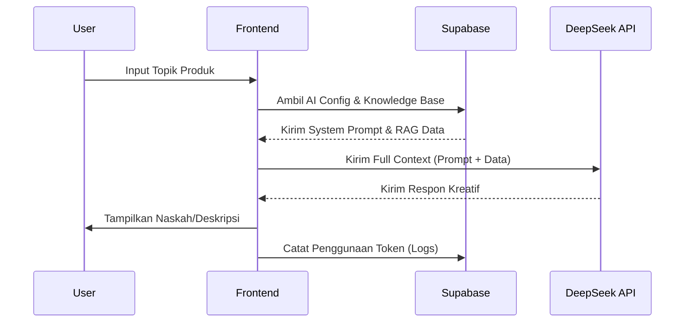

# 📊 Flowchart & Business Flow - Tokcer AI

## 1. Alur Pendaftaran & Approval (User Flow)
Berikut adalah perjalanan seorang Seller mulai dari mendaftar hingga akun aktif.

---

## 2. Alur Kerja Partner (Partner Flow)
Bagaimana seorang Partner membawa klien masuk.

---

## 3. Siklus Bisnis (Business Lifecycle)
Tahapan pertumbuhan ekosistem Tokcer AI:

1.  **Acquisition (Akuisisi)**:
    *   Visitor datang melalui iklan atau referral Partner.
    *   Pendaftaran via Landing Page atau Partner Dashboard.
2.  **Validation (Validasi)**:
    *   Admin memverifikasi bukti transfer dan jenis bisnis.
    *   Sistem otomatis menyiapkan kredensial akses.
3.  **Activation (Aktivasi)**:
    *   User menerima email akses.
    *   User mengoneksikan toko marketplace mereka.
4.  **Usage (Penggunaan)**:
    *   User menggunakan AI Generator untuk membuat konten harian.
    *   User memantau grafik analitik untuk strategi jualan.
5.  **Retention & Growth (Retensi & Pertumbuhan)**:
    *   Partner mendapatkan komisi berulang (recurring) jika user upgrade.
    *   Partner bersaing di Leaderboard untuk mendapatkan bonus tambahan.

---

## 4. Alur Integrasi AI (AI Generation Flow)
Bagaimana AI memberikan jawaban yang cerdas.

---
**Dibuat Oleh**: Antigravity AI (Siti)
**Tanggal**: 30 April 2026
