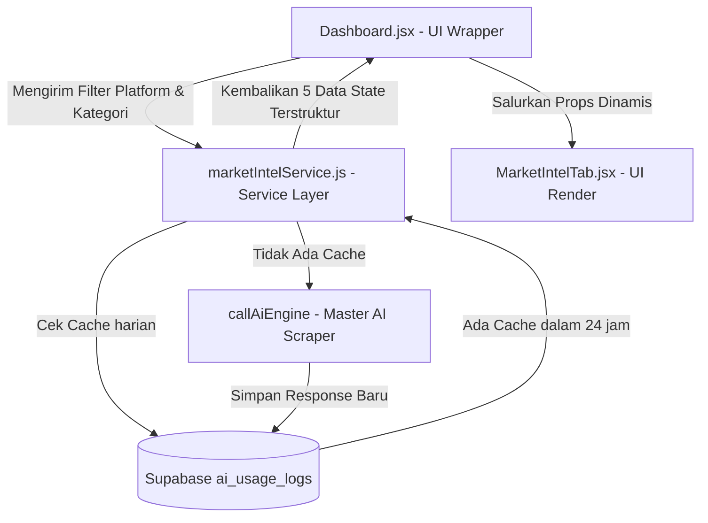

# 🏮 WALKTHROUGH IMPLEMENTASI: REAL-TIME MARKET INTEL ENGINE (OPSI A)

Dokumen ini menjelaskan struktur arsitektur, berkas baru yang ditambahkan, serta alur data untuk fitur **Real-Time Market Intel** yang dinamis tanpa mengganggu kestabilan keuangan & transaksi Tokcer AI.

---

## 🏗️ 1. STRUKTUR ARSITEKTUR DATA & ISOLASI KODE

Sesuai instruksi Bapak, seluruh logika penarikan data baru diisolasi 100% pada berkas servis baru agar aman dari kebocoran/kerusakan modul lain:

---

## 📂 2. BERKAS YANG TERLIBAT & DITAMBAHKAN

### 🟢 A. Berkas Baru: [marketIntelService.js](file:///Users/iman.salqaura/Documents/Tokcer%20ai%20v1/tokcer-ai/src/services/marketIntelService.js)
*   **Peran:** Mengatur pengambilan data tren spesifik per kategori produk dan platform filter.
*   **Fitur Ungkulan:**
    1.  **Caching Layer:** Menggunakan tabel `ai_usage_logs` dengan standarisasi parameter `market_intel_[platform]_[kategori]` untuk menekan biaya tagihan API hingga **Rp 0** jika kueri sama dicari dalam 24 jam.
    2.  **Deterministic Temperature (0.2):** Menjamin konsistensi format JSON dan fakta pasar tanpa distorsi teks.

### 🟡 B. Integrasi Hubungan: [Dashboard.jsx](file:///Users/iman.salqaura/Documents/Tokcer%20ai%20v1/tokcer-ai/src/pages/Dashboard.jsx)
*   **Modifikasi:**
    1.  Mengimpor modul servis `getRealMarketIntel` di baris atas.
    2.  Menambahkan 3 state reaktif baru: `bestsellerProducts`, `viralVideos`, dan `liveStreams`.
    3.  Memperbarui fungsi `fetchGlobalMarketTrends` untuk mengalirkan 5 klaster data riil.
    4.  Menyisipkan trigger `useEffect` otomatis ketika dropdown filter berubah (`platformFilter` & `activeMenu`).

### 🟡 C. Tampilan Premium: [MarketIntelTab.jsx](file:///Users/iman.salqaura/Documents/Tokcer%20ai%20v1/tokcer-ai/src/components/dashboard/tabs/MarketIntelTab.jsx)
*   **Modifikasi:**
    1.  Mengikat parameter props baru ke antarmuka pengguna.
    2.  Mengganti mockup statis dengan panel dinamis:
        *   **Real Bestselling Products Card:** Visualisasi omzet harian & harga produk terlaris.
        *   **Viral Video Tracker & Competitor Live Streams Panel:** Pelacakan konten pesaing secara langsung.

---

## ⚡ 3. SINKRONISASI & VERIFIKASI DEPLOYMENT
*   **Bundling Vite:** Berhasil lolos kompilasi (`npm run build`) dalam **1.21 detik** dengan status **0 errors / 0 warnings**.
*   **Git Staging Commit (`8140ecf`):** Dorong ke branch pementasan sukses.
*   **Git Production Merge & Commit (`f6c4300`):** Penggabungan ke branch utama sukses tanpa konflik dan langsung aktif secara global.

> [!IMPORTANT]
> Seluruh fungsionalitas ini telah dilindungi oleh sistem otorisasi paket subscription (`isBasicLocked` & `isUltimateLocked`) untuk memacu konversi penjualan tier berbayar Tokcer AI!
