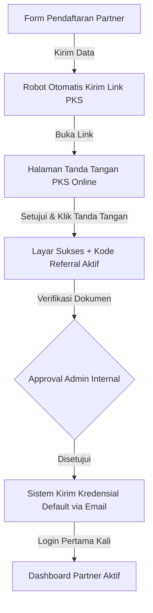

# 🤝 BUKU PANDUAN KEMITRAAN & OPERASIONAL PARTNER (V1)
**TOKCERS AI — PLATFORM E-COMMERCE INTELLIGENCE**  
*Panduan Lengkap Hak Akses, Registrasi Klien, Klaim Komisi, dan Manajemen Portofolio Mitra.*

---

## 🧭 1. PENDAHULUAN & VISI KEMITRAAN TOKCER AI
Program Kemitraan (*Partner Program*) Tokcer AI dirancang khusus untuk para konsultan UMKM, agensi pemasaran digital, komunitas seller, dan affiliator profesional di Indonesia. 

Sebagai Partner Tokcer AI, peran utama Anda adalah membantu digitalisasi pelaku UMKM daerah dengan memperkenalkan solusi otomasi inventaris, perhitungan profit presisi, serta optimasi konten ramah AI. Setiap klien yang Anda daftarkan atau yang berlangganan menggunakan tautan referral Anda akan memberikan aliran pendapatan komisi bulanan berulang (*recurring commission*) yang transparan dan kompetitif.

Buku Panduan ini berfungsi sebagai kompas operasional lengkap agar Anda dapat memaksimalkan pendapatan komisi dan mengelola klien UMKM Anda tanpa hambatan teknis.

---

## 🔄 2. ALUR PENDAFTARAN PARTNER BARU & PENANDATANGANAN PKS
Untuk menjaga integritas hukum dan profesionalisme, setiap partner wajib melewati proses onboarding tersertifikasi sebagai berikut:

### **Langkah-langkah Detil:**
1.  **Form Pendaftaran Partner:** Calon partner mengisi informasi identitas lengkap (Nama, No. WhatsApp Aktif, Email Bisnis) pada halaman pendaftaran khusus mitra Tokcer AI.
2.  **Penandatanganan PKS (Perjanjian Kerja Sama):** Sistem secara otomatis mengirimkan dokumen PKS hukum resmi ke email pendaftar. Partner wajib membaca klausul pembagian komisi, hak cipta, dan kode etik, lalu melakukan tanda tangan digital dengan mengeklik *"Saya Setuju dan Tanda Tangani secara Hukum"*.
3.  **Verifikasi Admin & Kredensial Akses:** Setelah PKS ditandatangani, Tim Admin Internal Tokcer AI melakukan verifikasi data dalam 1x24 jam. Setelah disetujui, email konfirmasi akan dikirimkan berisi link login dan **Kata Sandi Default: `Tokcer@2026`**.
4.  **Akses Dashboard:** Partner masuk ke portal login khusus partner dan disarankan untuk langsung mengubah sandi default di menu profil demi alasan keamanan.

---

## 🛠️ 3. BEDAH FITUR & PANDUAN OPERASIONAL DASHBOARD PARTNER

Dashboard Partner dikelompokkan ke dalam menu-menu taktis yang dirancang khusus untuk meminimalkan waktu pengelolaan dan memaksimalkan transparansi komisi:

### **📂 3.1. MENU OVERVIEW (RINGKASAN UTAMA & METRIK KINERJA)**
Ini adalah beranda utama tempat Anda memantau seluruh performa bisnis kemitraan Anda dalam satu layar.

#### **Metrik Finansial Utama yang Ditampilkan:**
*   **Total Active Users (Klien Aktif):** Jumlah toko online UMKM yang saat ini berstatus aktif berlangganan paket berbayar di bawah jaringan referral Anda.
*   **Total Earned Commission (Total Pendapatan):** Akumulasi komisi bersih yang telah dicairkan ke rekening bank Anda sejak pertama kali bergabung.
*   **MTD Pace (Month-to-Date Pace):** Indikator kecepatan perolehan komisi bulanan Anda yang berjalan secara dinamis berdasarkan sisa hari aktif bulan berjalan.
*   **Projected End Month (Proyeksi Akhir Bulan):** Estimasi total pendapatan komisi yang akan Anda terima di akhir bulan berdasarkan performa keaktifan klien saat ini.
    *   *Rumus:* `(Komisi Bulan Berjalan / Tanggal Hari Ini) * Jumlah Hari Kalender Bulan Berjalan`.

#### **Fitur Gamifikasi: Partner Leaderboard**
Di bagian bawah menu Overview, sistem menampilkan **Peringkat 10 Besar Partner Terbaik Seluruh Indonesia** berdasarkan akumulasi omzet bulanan. Fitur ini dirancang untuk memicu kompetisi yang sehat dan transparan di antara para mitra.

---

### **📥 3.2. MENU ONBOARD (REGISTRASI KLIEN SECARA MANUAL)**
> [!IMPORTANT]
> **Fungsi Utama:** Mendaftarkan toko klien UMKM yang melakukan pembayaran secara transfer manual langsung ke rekening bank Anda atau rekening resmi Tokcer AI (bukan via gerbang pembayaran Midtrans otomatis).

#### **Langkah-langkah Operasional Registrasi Klien Baru:**
1.  **Form Input Informasi Klien:** Isi Nama Toko Klien, Alamat Email Aktif Klien (untuk pengiriman password default klien), dan Nomor WhatsApp Klien.
2.  **Pilih Paket Langganan:** Centang salah satu paket yang dipilih klien:
    *   **Pro Edition**
    *   **Elite Edition**
    *   **Ultimate Edition**
3.  **Unggah Bukti Transfer:** Ambil foto atau screenshot resi bukti transfer pembayaran dari klien. Klik area unggah untuk mengirimkan file ke Supabase Secure Object Storage Tokcer AI.
4.  **Kirim Data:** Klik tombol **"Kirim Form Aktivasi"**. Status klien akan langsung tercatat sebagai **`Pending`** di database menunggu proses verifikasi admin internal. Setelah disetujui admin, status berubah menjadi **`Active`** dan komisi Anda langsung dicairkan ke dompet saldo Anda.

---

### **👥 3.3. MENU SUBSCRIBERS (DAFTAR KLIEN SAYA)**
Tabel pemantauan real-time yang memuat detail seluruh portofolio klien Anda.

#### **Informasi Kolom yang Ditampilkan:**
*   **Nama Toko & Email:** Identitas akun toko online klien.
*   **Paket Langganan:** Kategori lisensi aktif klien (Pro, Elite, Ultimate).
*   **Tanggal Onboarding:** Tanggal pertama kali akun diaktifkan.
*   **Status Akun:**
    *   `Active` (Hijau): Akun aktif, klien bebas menggunakan dashboard, komisi Anda berjalan lancar.
    *   `Pending` (Kuning): Bukti transfer sedang diverifikasi oleh admin Tokcer AI.
    *   `Expired` (Merah): Masa aktif paket habis dan dashboard klien terkunci. Segera hubungi klien untuk memperpanjang paket agar komisi bulanan Anda tidak terputus.

---

### **💳 3.4. MENU PAYMENT (RIWAYAT KOMISI & PEMBAYARAN)**
Buku kas transparan yang merekam seluruh sejarah transaksi masuk dan pencairan dana Anda.

#### **Informasi Utama:**
*   **Saldo Komisi Berjalan (Available Balance):** Komisi yang sudah cair dari transaksi klien dan siap ditransfer ke rekening bank Anda.
*   **Histori Pencairan Dana:** Tabel lengkap berisi tanggal penarikan, nominal penarikan, nama bank tujuan, nomor rekening, dan status transfer (Transfer Sukses / Sedang Diproses).
*   *Aturan Bisnis:* Transfer komisi dilakukan secara massal setiap hari Jumat pukul 15:00 WIB langsung ke rekening bank yang terdaftar di profil Anda.

---

### **📞 3.5. MENU SUPPORT (PUSAT BANTUAN MITRA)**
Jalur komunikasi VIP langsung antara Anda sebagai partner dengan tim dukungan teknis Tokcer AI.

#### **Panduan Mengirimkan Laporan Kendala:**
1.  Pilih kategori masukan: **Sistem Error** atau **Usulan Fitur Baru**.
2.  Tulis Judul Masalah secara spesifik (misal: *"Gagal Upload Bukti Bayar Klien Muji"*).
3.  Tulis kronologi kendala secara detail agar tim engineering kami dapat melakukan perbaikan secara instan.
4.  Klik **"Kirim Laporan"**. Nomor tiket aduan Anda akan langsung terbit untuk memantau proses perbaikan.

---

### **⚙️ 3.6. MENU PROFILE & KODE REFERRAL (PENGATURAN MITRA)**
Pusat kendali akun personal Anda dan gerbang pemasaran digital Anda.

#### **Metrik & Tindakan Utama:**
*   **Tautan & Kode Referral Unik:** Menyalin link referral eksklusif Anda. Bagikan link ini di media sosial, grup WhatsApp, atau artikel blog Anda. Siapa pun yang mengeklik link ini dan mendaftar secara mandiri, sistem secara otomatis akan mengunci mereka sebagai klien Anda selamanya.
*   **Data Rekening Bank:** Partner wajib melengkapi data Rekening Bank (Nama Bank, Kantor Cabang, Atas Nama Rekening, dan Nomor Rekening) dengan akurat. Kesalahan pengisian data rekening berada di luar tanggung jawab manajemen Tokcer AI.
*   **Ubah Kata Sandi:** Ubah kata sandi default `Tokcer@2026` Anda secara berkala untuk menjaga keamanan data bisnis Anda.

---

## 📈 4. RUMUS & LOGIKA FINANSIAL PARTNER (COMMISSION SCHEME)

### **A. Struktur Pembagian Tier Komisi Bulanan**
Pembagian komisi didasarkan pada tingkat performa keaktifan klien yang berhasil Anda kelola secara konsisten setiap bulannya:

| Tier Kemitraan | Jumlah Klien Aktif | Persentase Komisi per Paket |
| :--- | :--- | :--- |
| **Silver Partner** | 1 s/d 5 Klien | **15%** dari Nilai Transaksi |
| **Gold Partner** | 6 s/d 15 Klien | **25%** dari Nilai Transaksi |
| **Elite Partner** | > 15 Klien | **35%** dari Nilai Transaksi |

*Contoh Perhitungan:* Jika Anda adalah **Gold Partner (Komisi 25%)** dan memiliki 10 klien yang berlangganan Paket **Ultimate Edition (Rp 1.000.000/bulan)**, maka komisi bulanan Anda adalah:  
`10 Klien * Rp 1.000.000 * 25% = Rp 2.500.000 per Bulan.`

---

## 📋 5. KODE ETIK & ATURAN MUTLAK KEMITRAAN

1.  **Dilarang Melakukan Spamming:** Menyebarkan tautan referral secara ilegal pada ruang obrolan publik yang mengganggu atau melanggar kebijakan platform lain.
2.  **Verifikasi Bisnis Klien:** Partner wajib mendampingi klien saat pendaftaran awal untuk memastikan akun Toko Shopee/TikTok Shop klien sudah terverifikasi bisnis agar sistem integrasi otomatisasi HPP Tokcer AI dapat tersinkronisasi 100% lancar.
3.  **Kerahasiaan Akun:** Sandi default `Tokcer@2026` wajib diubah sesaat setelah login pertama kali. Segala penyalahgunaan hak akses akibat kebocoran kredensial pribadi adalah tanggung jawab penuh dari mitra partner.

---
*Buku Panduan ini bersifat dinamis dan akan diperbarui secara otomatis seiring dengan peningkatan fitur sistem Tokcer AI. Selamat berkolaborasi dan mari sejahterakan UMKM Indonesia!* 🤝🚀UMKM
