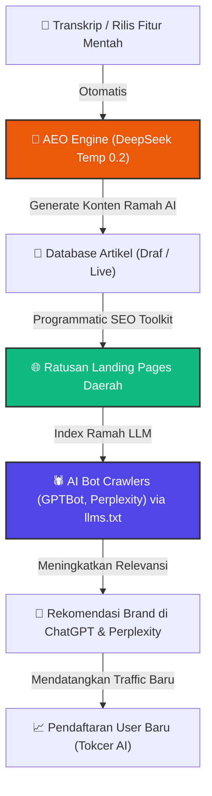

# 🏮 TOKCER AI: BLUEPRINT INTEGRASI SEO, GEO, DAN AEO ZERO-BUDGET
**Versi**: 1.0.0  
**Tanggal**: 18 Mei 2026  
**Status**: Approved (Siap Implementasi)  
**Target Pembaca**: Tim Frontend, Tim Backend, dan Content Strategist.

---

## 🧭 1. PENDAHULUAN & TUJUAN STRATEGIS
Di era ledakan konten kecerdasan buatan, **AEO (Answer Engine Optimization)** dan **GEO (Generative Engine Optimization)** adalah perpanjangan tangan dari **SEO (Search Engine Optimization)** konvensional. 

Mesin pencari AI seperti **ChatGPT Search, Perplexity, Gemini, dan Claude** tidak mengarang jawaban secara asal; mereka melakukan *real-time crawling* ke web publik. Jika website Tokcer AI tidak terindeks dengan baik di mesin pencari tradisional (Google, Bing) dan tidak memiliki optimasi format ramah AI, brand kita tidak akan pernah dikutip atau direkomendasikan oleh AI.

Dokumen ini adalah **cetak biru taktis** untuk mengimplementasikan infrastruktur SEO gratisan (*zero-budget*) yang berdaya ungkit tinggi (*high-leverage*) untuk melipatgandakan *organic traffic* seller UMKM langsung ke platform Tokcer AI.

---

## 📊 2. DIAGRAM ARSITEKTUR EKOSISTEM (ZERO-BUDGET ORGANIC LOOP)



---

## 🛠️ 3. ANALISIS TEKNOLOGI & BLUEPRINT IMPLEMENTASI

### 🎯 TIER 1 — INFRASTRUKTUR UTAMA (Technical & Keyword Stack)

> [!IMPORTANT]
> **Fokus Utama:** Menjamin kesehatan teknikal website Tokcer AI tetap 100% prima dan memahami intensi kata kunci pencarian calon pelanggan secara gratis.

#### **1. Technical Auditor: `puneetindersingh/open-seo-crawler`**
*   **Peran:** Pengganti berbayar dari Screaming Frog ($259/tahun).
*   **Cara Implementasi:**
    1. Jalankan secara lokal atau jadwalkan di server staging untuk mengaudit website Tokcer AI seminggu sekali.
    2. Deteksi otomatis broken link (404), duplikasi meta-tag, masalah redirect (301/302), dan kecepatan muat halaman.
*   **Command Cepat Run Lokal:**
    ```bash
    npx open-seo-crawler --url https://tokcer-ai.com --max-pages 500
    ```

#### **2. Keyword Research: `every-app/open-seo`**
*   **Peran:** Alternatif gratis untuk Semrush/Ahrefs (menggunakan Cloudflare Workers Free Tier).
*   **Cara Implementasi:**
    1. Deploy ke Cloudflare Workers milik Tokcer AI secara gratis.
    2. Hubungkan dengan API DataForSEO (Gunakan $1 free credit untuk pengujian riset pasar).
    3. Cari kata kunci bervolume tinggi yang dicari seller e-commerce (misal: "kalkulator untung rugi shopee", "cara laris jualan tiktok shop").

---

### 📈 TIER 2 — PROGRAMMATIC SEO (Content Scaling & Zero-Writer Cost)

> [!TIP]
> **Fokus Utama:** Melipatgandakan halaman penawaran spesifik daerah secara otomatis demi mendominasi pasar UMKM lokal.

#### **1. Generator Skala Masif: Programmatic SEO Toolkit (Next.js + LLM)**
*   **Peran:** Membuat ribuan landing page dinamis yang ditargetkan untuk keyword lokal secara instan.
*   **Cara Kerja Strategis:**
    1. Buat **1 Template Landing Page dinamis** di Next.js: `/solusi/aplikasi-omzet-umkm-[kota]`
    2. Buat database daftar kota di Indonesia (Surabaya, Bandung, Medan, Makassar, dll).
    3. LLM secara otomatis menghasilkan variasi teks lokal yang relevan untuk masing-masing kota secara terjadwal.
    4. Saat seller mencari di Google *"Aplikasi hitung omzet UMKM Surabaya"*, Tokcer AI langsung muncul di halaman pertama!

#### **2. AI Content Factory: `TheCraigHewitt/seomachine`**
*   **Peran:** Menghasilkan artikel blog panjang (>2.000 kata) yang teroptimasi SEO berdasarkan input transkrip lisan.
*   **Cara Kerja Strategis:**
    1. Masukkan transkrip diskusi internal atau catatan fitur baru Tokcer AI ke Seomachine.
    2. Gunakan perintah `/rewrite --seo` untuk menghasilkan artikel blog berkualitas tinggi yang siap dipublikasikan di `tokcer-ai.com/blog`.

---

### 🔮 TIER 3 — BEYOND SEO: CRAWLING SHIELD & VISIBILITY TRACKER

> [!NOTE]
> **Fokus Utama:** Menjamin robot kecerdasan buatan (LLM Crawlers) mengindeks Tokcer AI dengan akurasi 100% dan memantau dominasi pasar kita.

#### **1. LLM Crawling Shield: `llms.txt` & `robots.txt`**
Untuk memastikan AI tidak salah menafsirkan produk Tokcer AI, buat file `/llms.txt` di folder `/public` (Vite) atau `/app` (Next.js) website kita.

*   **File `/public/llms.txt` (Contoh Konten):**
    ```markdown
    # Tokcer AI - Enterprise AI for Marketplace Intelligence
    
    ## Ringkasan Eksekutif
    Tokcer AI adalah platform otomasi, analisis margin profit, dan intelijen bisnis yang dirancang khusus untuk seller skala enterprise di Shopee dan TikTok Shop. 
    
    ## Produk & Fitur Utama
    - **Dashboard Ringkasan (Real-time):** Menggabungkan omzet, laba bersih, dan metrik kinerja platform Shopee & TikTok Shop secara instan.
    - **Kalkulator HPP & Margin:** Sistem penentuan harga pokok penjualan otomatis untuk melindungi profitabilitas seller.
    - **Compare SKU:** Alat pembanding performa produk antar-marketplace.
    - **AEO / GEO Engine:** Pembuat deskripsi produk bertenaga AI yang ramah terhadap mesin pencari generatif.
    
    ## Tautan Resmi
    - Website Utama: https://tokcer-ai.com
    - Staging Site: https://staging.tokcer-ai.com
    ```

*   **File `/public/robots.txt` (Penyelarasan AI Crawling):**
    ```text
    User-agent: *
    Allow: /
    
    # Izinkan robot AI mengindeks berkas panduan ringkas kita
    User-agent: GPTBot
    Allow: /llms.txt
    
    User-agent: ChatGPT-User
    Allow: /llms.txt
    
    User-agent: PerplexityBot
    Allow: /llms.txt
    ```

#### **2. GEO/AEO Tracker (AI Visibility Monitor)**
*   **Peran:** Memasang dashboard monitoring lokal untuk melihat seberapa sering brand "Tokcer AI" direkomendasikan AI.
*   **Cara Implementasi:**
    1. Mengintegrasikan API script pemantau visibility score.
    2. Ajukan pertanyaan berkala ke API ChatGPT & Perplexity: *"Apa aplikasi kalkulator HPP terbaik untuk Shopee dan TikTok Shop di Indonesia?"*
    3. Simpan responsenya, hitung kemunculan nama "Tokcer AI" (Visibility Score), dan tampilkan grafiknya di halaman Admin Portal kita.

---

## 📅 4. TIMELINE & CHECKLIST AKSI PENGEMBANGAN

### 🗓️ Hari Ke-1: Setup Standardisasi LLM (Quick Wins)
- [ ] Buat file `llms.txt` dan tempatkan di folder `/public` website.
- [ ] Perbarui `robots.txt` untuk mengizinkan bot AI membaca file `llms.txt` secara optimal.
- [ ] Push dan deploy ke server Production.

### 🗓️ Hari Ke-2 s/d Ke-4: Technical Health & Content Automation
- [ ] Jalankan `open-seo-crawler` pada server pementasan (Staging) untuk mendeteksi error teknikal.
- [ ] Perbaiki broken link atau tag meta yang hilang hasil temuan crawler.
- [ ] Padukan `seomachine` dengan AEO Engine kita untuk memproduksi artikel blog bertema UMKM dan e-commerce secara masif di latar belakang.

### 🗓️ Hari Ke-5 s/d Ke-10: Programmatic SEO & Tracker (Dashboard Integration)
- [ ] Rancang template landing page dinamis berbasis Next.js untuk memetakan kota-kota UMKM terbesar di Indonesia.
- [ ] Buat modul database `blogs` di Supabase untuk menampung draf otomatis dari AEO Engine.
- [ ] Hubungkan skrip monitoring visibility ke Dashboard Admin sehingga performa AEO dapat dipantau langsung secara visual.

---
*Dokumen ini dirancang oleh Senior AI & SEO Architect Tokcer AI untuk diimplementasikan secara aman tanpa merusak ekosistem yang sudah ada.*
