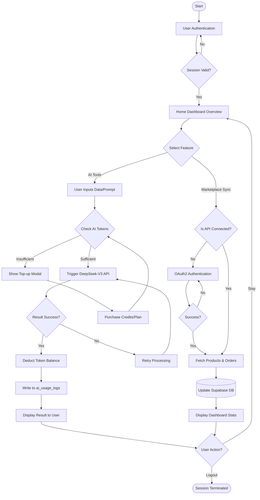

# 🏮 TOKCER AI: Detailed Logic Flowchart (User Dashboard)

Dokumen ini adalah peta logika sistem "Jika-Maka" (Decision Logic) yang mengatur seluruh Dashboard User Tokcer AI.

---

## 1. Visual Logic Flow (BPMN Style)

---

## 2. Definisi Parameter Logika

### 🛡️ Token Guard Logic (The Gatekeeper)
Sistem melakukan pengecekan saldo token di tabel `profiles` sebelum melakukan *request* ke DeepSeek. 
*   **Trigger**: Tombol 'Generate' atau 'Analyze'.
*   **Exception**: User dengan `subscription_plan = 'ultimate'` akan melewati pengecekan saldo, namun tetap melakukan pencatatan log.

### 📝 Audit Logging Logic
Setiap output AI wajib dicatat untuk transparansi operasional:
1.  **Input**: Menyimpan `prompt` mentah dari user.
2.  **Output**: Menyimpan hasil jawaban AI secara penuh.
3.  **Metrics**: Menghitung `input_tokens` + `output_tokens` untuk kalkulasi biaya ($0.14 - $0.28).

---

## 3. Status Alur Kerja (Production Ready)

1.  **Auth Flow**: 100% Stable (Supabase Auth).
2.  **Sync Flow**: 80% (TikTok Shop Beta, Shopee Stable).
3.  **AI Flow**: 100% Stable (DeepSeek Integration).
4.  **Audit Flow**: 100% Stable (Live in Internal Dashboard).

---
*Generated by Antigravity Core Command v2.5*
