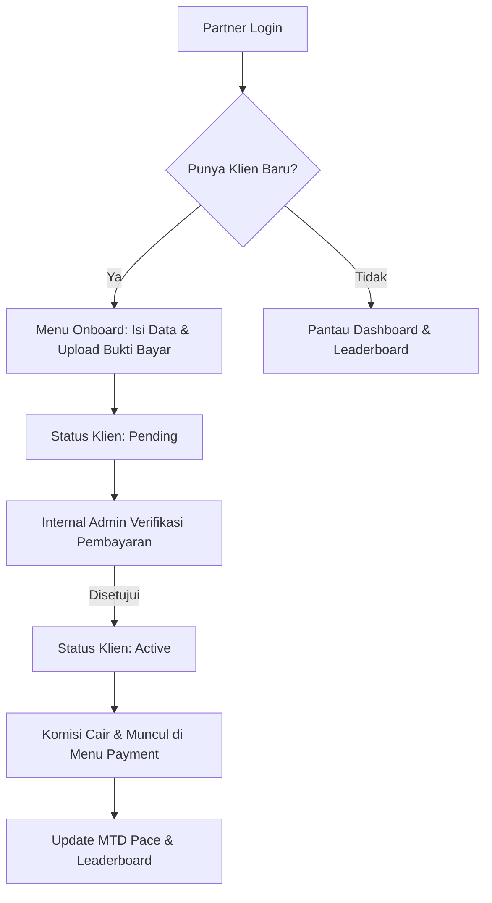
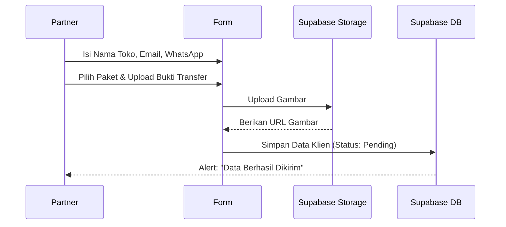
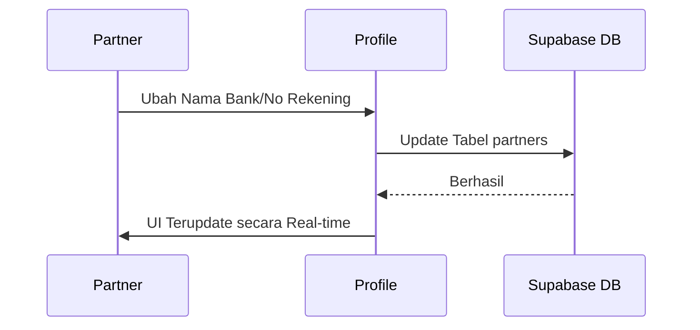

# 📘 Dokumentasi Teknis: Dashboard Partner Tokcer AI

Dokumen ini menjelaskan secara mendalam arsitektur, logika, dan alur bisnis dari Dashboard Partner dalam ekosistem Tokcer AI.

---

## 1. 🏗️ Arsitektur Backend (Supabase)
Sistem ini menggunakan **Supabase** sebagai tulang punggung backend dengan komponen utama:
*   **Database (PostgreSQL)**:
    *   `partners`: Menyimpan data profil partner (nama, WhatsApp, bank, tier, affiliate_id).
    *   `clients`: Menyimpan data pelanggan yang didaftarkan oleh partner.
    *   `support_tickets`: Menyimpan laporan bug atau masukan fitur dari partner.
*   **Storage (Object Storage)**:
    *   `payment-proofs`: Folder khusus untuk menyimpan gambar bukti transfer yang diupload oleh partner saat mendaftarkan klien.
*   **Auth**: Mengelola sesi login partner menggunakan email dan password.

---

## 2. 🧠 Logika Pengambilan Data (Data Fetching)
Sistem menggunakan pola **"Single Source of Truth"** yang ditarik saat komponen pertama kali dimuat (*on-mount*):

1.  **Identifikasi User**: Mengambil sesi aktif via `supabase.auth.getSession()`.
2.  **Profile Fetching**: Mencari data di tabel `partners` menggunakan `id` (Auth ID) atau `email` sebagai fallback.
    *   *Query*: `.or(id.eq.USER_ID, email.eq.USER_EMAIL)`
3.  **Client Fetching**: Mengambil semua data dari tabel `clients` yang memiliki `partner_id` sama dengan ID partner yang sedang login.
    *   *Urutan*: Diurutkan berdasarkan `created_at` terbaru.
4.  **Performance Calculation**:
    *   **Active Users**: Menghitung jumlah klien dengan status `active`.
    *   **MTD Pace**: Menjumlahkan seluruh `commission_amount` dari klien yang berstatus `active`.
    *   **Projected End Month**: Menggunakan rumus: `(Total Komisi Saat Ini / Tanggal Sekarang) * Jumlah Hari dalam Sebulan`.

---

## 3. 📤 Logika Pengiriman Data (Data Submission)
### A. Aktivasi Klien Baru (Onboarding)
1.  **Upload Phase**: File bukti bayar dikirim ke storage `payment-proofs` dengan format path `${user_id}/${timestamp}-${filename}`.
2.  **URL Generation**: Mengambil *Public URL* dari file yang berhasil diupload.
3.  **Database Phase**: Memasukkan baris baru ke tabel `clients` dengan status default `pending`.
4.  **Validation**: Mengecek apakah sesi masih aktif sebelum proses dimulai untuk mencegah kegagalan database.

### B. Update Profil
1.  Melakukan perintah `.update()` pada tabel `partners` berdasarkan `id` partner.
2.  Data yang diupdate meliputi: Nama Lengkap, WhatsApp, Nama Bank, dan Nomor Rekening.
3.  Setelah berhasil, sistem memanggil kembali fungsi `fetchData()` untuk memperbarui UI tanpa refresh halaman.

---

## 4. 📈 Flow Bisnis Partner

---

## 5. 🛠️ Detail Fitur per Menu
1.  **Onboard (Aktivasi)**: Fitur "pintu masuk" klien. Partner mendaftarkan toko klien, memilih paket (Ultimate/Elite/Pro), dan mengupload bukti bayar.
2.  **Subscribers (Daftar Pelanggan)**: Tabel monitoring real-time. Partner bisa melihat siapa saja klien mereka yang sudah aktif, masih tertunda (pending), atau bermasalah.
3.  **Leaderboard (Peringkat)**: Fitur gamifikasi. Menampilkan 10 besar partner terbaik berdasarkan omzet bulanan untuk memicu kompetisi sehat.
4.  **Payment (Pembayaran)**: Menampilkan riwayat komisi yang sudah dihasilkan dari setiap penjualan paket.
5.  **Support (Bantuan)**: Jalur komunikasi langsung ke tim teknis jika ada kendala data atau ingin memberikan ide fitur.
6.  **Profile (Pengaturan)**: Tempat partner mengatur data rekening bank untuk pencairan komisi dan mengganti password akun.

---

## 6. 🔄 Flowchart per Menu Utama

### Menu Onboard (Registrasi Klien)

### Menu Profile (Update Data)

---

## 7. 💡 Catatan Penting untuk Peluncuran
*   **Isolasi Data**: Partner A tidak akan pernah bisa melihat data klien milik Partner B karena setiap query dikunci oleh `partner_id`.
*   **Keamanan File**: Bukti transfer disimpan di folder pribadi masing-masing partner di storage Supabase.
*   **Stabilitas**: Sistem menggunakan blok `finally` pada setiap proses loading untuk memastikan UI tidak pernah macet (*infinite loading*).

---
**Dibuat oleh**: Udin (Antigravity AI)
**Status**: Final & Terverifikasi
**Tanggal**: 30 April 2026 (Launch Eve)
