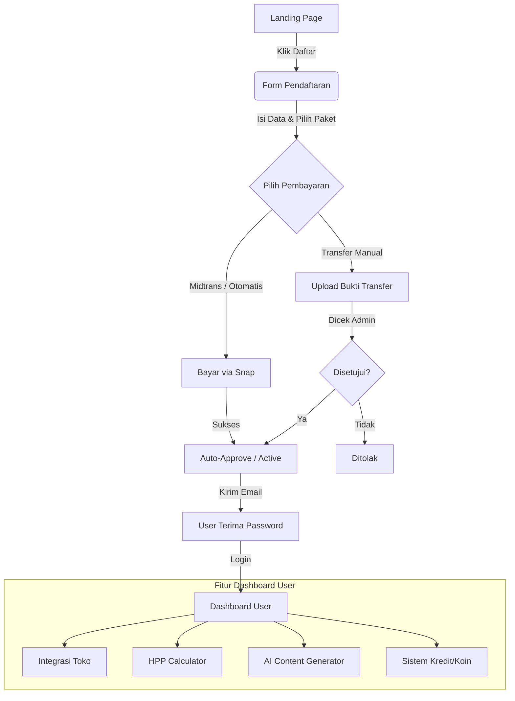
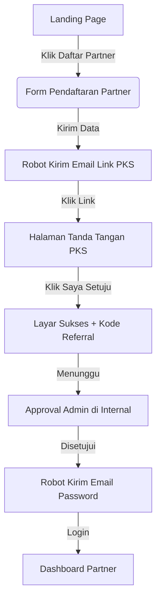
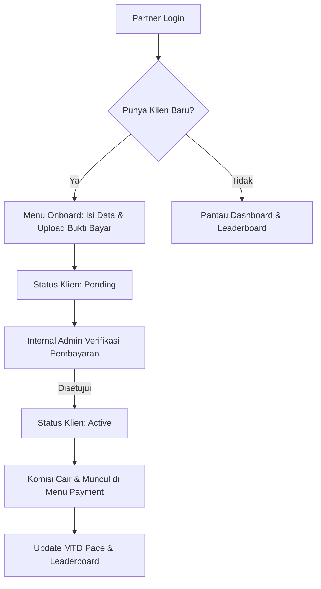
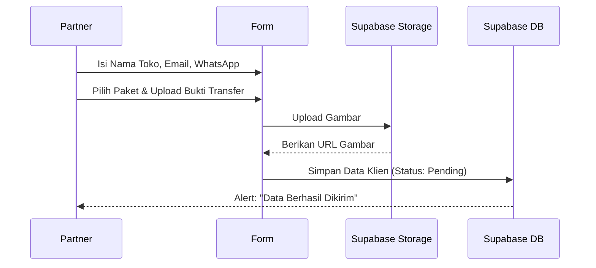

# 📊 Manual Guide & Flowchart Dashboard Tokcer AI

Dokumen ini berisi panduan alur kerja (flowchart) untuk **Dashboard User** dan **Dashboard Partner** di Tokcer AI. Dokumen ini dibuat untuk membantu tim dalam menyusun manual detail (Buku Panduan) untuk pengguna.

---

## 👤 1. Alur Dashboard User (Klien)

Dashboard User digunakan oleh para penjual online (online sellers) untuk mengelola toko, menghitung HPP, dan membuat konten AI.

### 📍 Flowchart Alur Registrasi & Aktivasi User

### 📝 Penjelasan Alur User:
1.  **Pendaftaran**: User mendaftar di landing page, mengisi data diri, memilih paket (Pro/Elite/Ultimate), dan memilih platform jualan.
2.  **Validasi Bisnis**: User **wajib** mencentang bahwa akun marketplace mereka sudah terverifikasi bisnis agar tombol bayar menyala.
3.  **Pembayaran**: Jika sukses bayar via Midtrans, akun langsung aktif. Jika manual, menunggu approval admin.
4.  **Akses**: User menerima email berisi password default untuk login ke Dashboard User.

---

## 🤝 2. Alur Dashboard Partner (Affiliator)

Dashboard Partner digunakan oleh para affiliator untuk menyebarkan link referral, mendaftarkan klien secara manual, dan memantau komisi.

### 📍 Flowchart Alur Registrasi Partner

### 📍 Flowchart Bisnis Partner (Diambil dari docs)

### 📍 Flowchart Menu Onboard (Registrasi Klien oleh Partner)

---

## 🛠️ Catatan untuk Pembuatan Manual Detail:
*   Pastikan mencantumkan bahwa **Sandi Default** untuk Partner baru adalah `Tokcer@2026`.
*   Ingatkan seller/partner bahwa **Verifikasi Bisnis** di marketplace adalah syarat mutlak agar fitur otomatisasi Tokcer AI berjalan lancar.

---
*Dibuat oleh Ujang untuk kemudahan tim Tokcer AI.* 🫡🛡️🏮🔥
